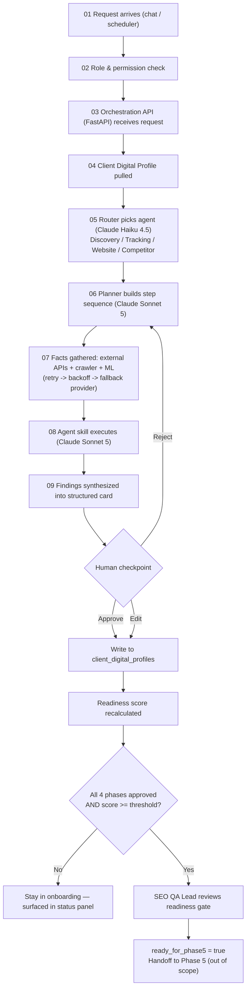
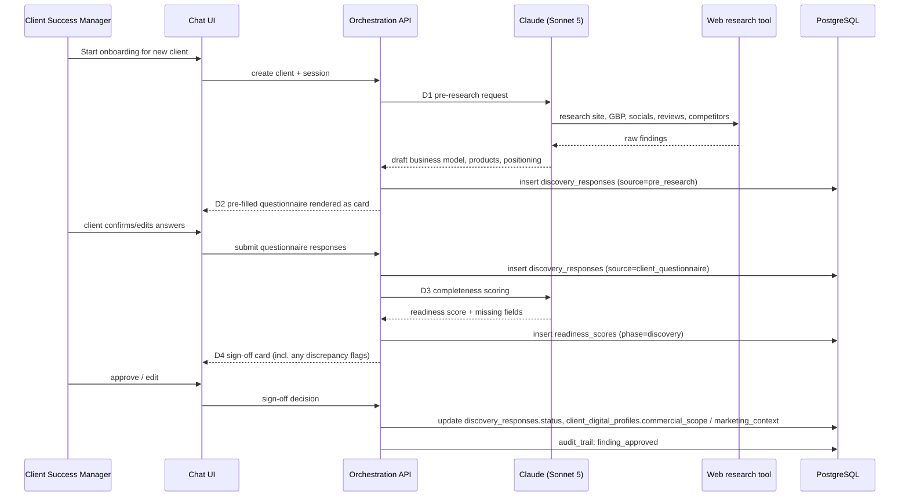
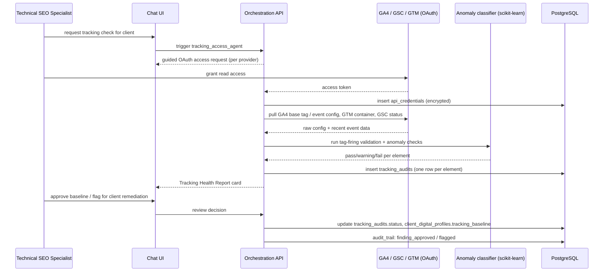
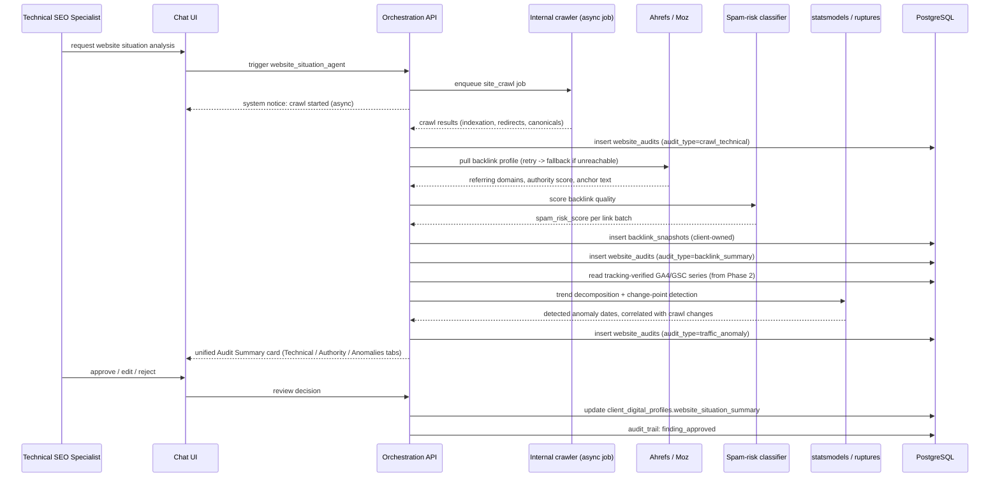
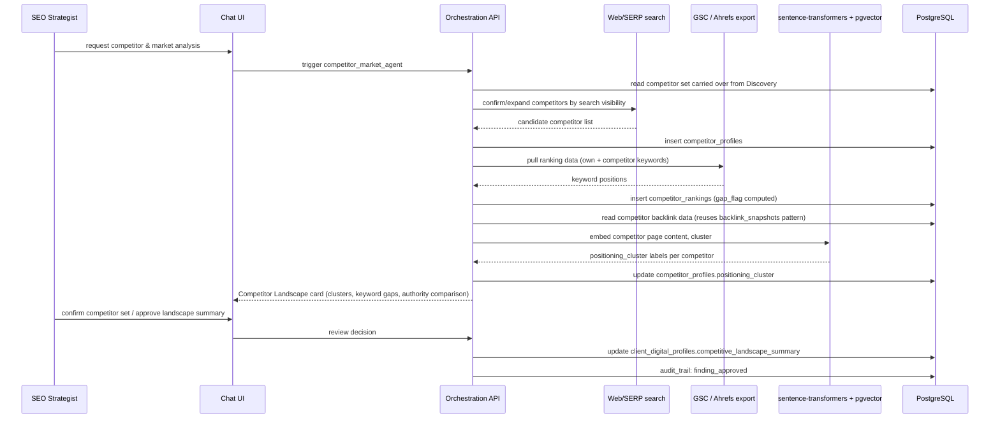
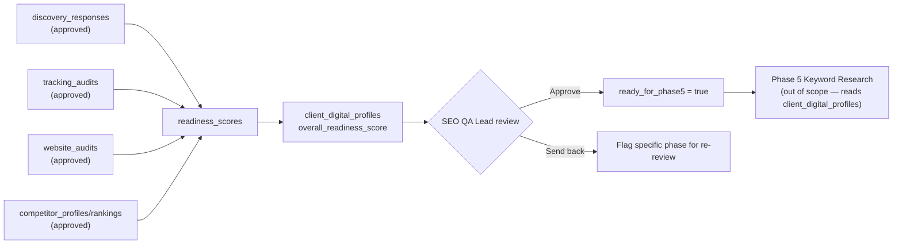
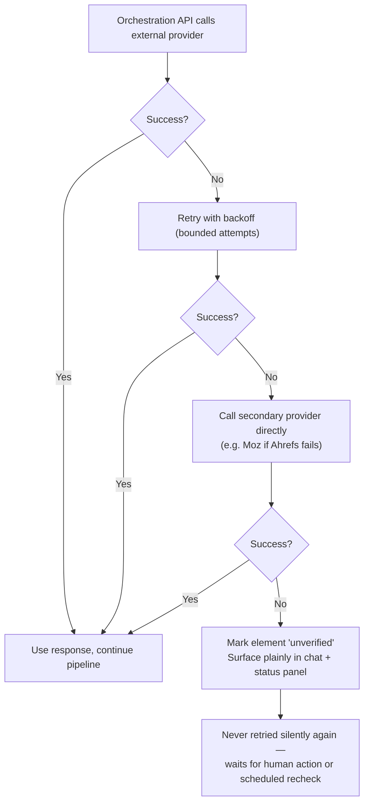
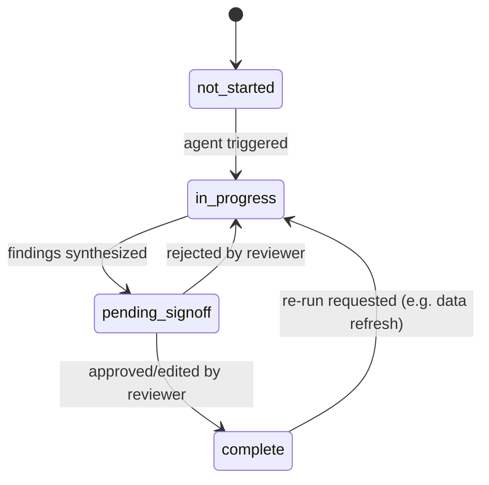

App Flow — Data Flow Across the Application

SearchFit Onboarding & Audit Agent — Phase 1–4

Version: 1.0
Date: August 4, 2026

---

1. Overall Orchestration (scoped from TR's 15-step architecture)

This build uses steps 01–09 of Traffic Radius's existing orchestration pattern, then substitutes a Client Digital Profile write for the publish steps (10–14), since Phases 1–4 never touch a live CMS.



2. Phase 1 — Business & Project Discovery

Adapts the D1–D5 discovery workflow, run once per new client, before any other phase can meaningfully start.



3. Phase 2 — Access, Tracking & Data Collection



If OAuth access is not granted immediately, the flow does not block: the agent marks the relevant element `unverified`, surfaces it in the status panel, and re-checks on a schedule (Celery beat task) rather than stalling Phase 3.

4. Phase 3 — Current Website Situation Analysis



5. Phase 4 — Competitor & Market Analysis



Competitor research results are cached (Redis, 14-day default window per TRD Section 5) so re-running Phase 4 for the same client shortly after doesn't re-pay for a full scan.

6. Readiness Gate — Cross-Phase Data Flow



7. Error / Fallback Data Flow (applies to every external call in Sections 2–5)



8. State Model — Per-Phase Status

Each phase's status field in `client_digital_profiles` moves through the same states, driven entirely by the flows above:



9. Session-Level Data Flow Summary

A single client engagement produces exactly one thread of data, end to end:

```
Client identity (clients)
   -> one chat_sessions row per active engagement
      -> many chat_messages (full conversational record, all 4 agents)
      -> many agent_jobs (async work backing the conversation)
   -> findings written per phase (discovery_responses / tracking_audits / website_audits / competitor_profiles+rankings)
   -> every finding indexed in findings_ledger for reviewer visibility
   -> every action logged in audit_trail (nothing untraceable)
   -> approved findings roll up into client_digital_profiles (the one handoff artifact)
   -> readiness_scores computed per phase, aggregated into overall_readiness_score
   -> SEO QA Lead gate flips ready_for_phase5, unlocking everything downstream (out of this build's scope)
```
